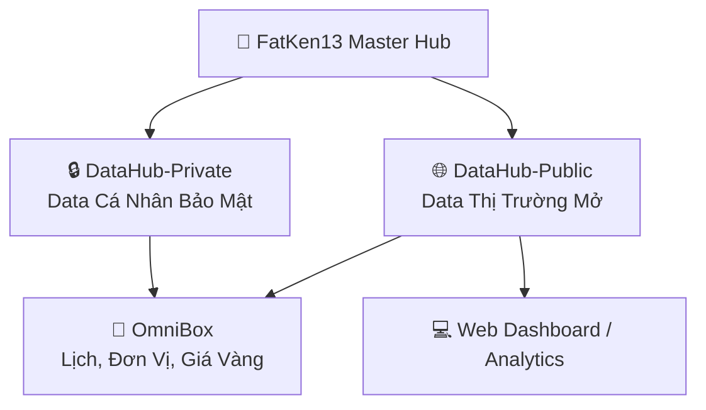

# 👋 Xin chào, tôi là FatKen13!
> *Full-stack Developer & Creator of OmniBox Ecosystem*

---

## 🏛️ BẢN ĐỒ HỆ SINH THÁI DỰ ÁN (ECOSYSTEM MAP)

---

## 🚀 DANH SÁCH DỰ ÁN & REPOSITORIES

| Dự án | Loại | Mô tả | Liên kết |
| :--- | :--- | :--- | :--- |
| **📱 OmniBox** | Frontend / PWA | Lịch Vạn Niên GMT+7, Đổi Đơn Vị 9 nhóm, Giá Vàng & Tỷ Giá Vietcombank | [🔗 Repo](https://github.com/FatKen13/OmniBox) • [🌐 Live App](https://fatken13.github.io/OmniBox/) |
| **🌐 DataHub-Public** | Public Data | Kho API JSON miễn phí: Giá vàng SJC, Tỷ giá VCB, Giá xăng Petrolimex | [🔗 Repo](https://github.com/FatKen13/DataHub-Public) |
| **🔒 DataHub-Private** | Private Vault | Kho lưu trữ dữ liệu cá nhân bảo mật: Thu chi, Ngân sách, Sổ vàng | [🔒 Repo (Private)](https://github.com/FatKen13/DataHub-Private) |

---

## 📚 TÀI LIỆU QUY CHUẨN & KIẾN TRÚC HỆ THỐNG

Tất cả các dự án trong hệ sinh thái đều tuân theo bản thiết kế chuẩn:
* 🏛️ **[Tài liệu Kiến trúc Toàn diện (ARCHITECTURE.md)](./docs/ARCHITECTURE.md)**: Chi tiết cấu trúc thư mục, Schemas JSON, cơ chế crawler và SDK đồng bộ.
* 📋 **[Khung Mẫu Dự Án Mới (PROJECT_TEMPLATE.md)](./templates/PROJECT_TEMPLATE.md)**: File mẫu copy nhanh khi bắt đầu dự án mới.

---

## 🛠️ CÔNG NGHỆ CHỦ ĐẠO
`HTML5` • `Vanilla CSS3 (Glassmorphism)` • `Modern JavaScript (ES6+)` • `Python Automation` • `GitHub Actions CI/CD` • `PWA`
